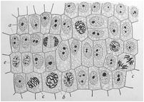
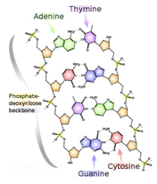

# Propuesta de Problema

## Presentación del problema - Una Rápida Introducción a la Biología Molecular

Constituyendo todo el material vivo, la célula es considerada como el bloque de construcción de la vida. El núcleo, un componente de la mayoría de las células eucariotas, fue identificado como el centro de la actividad celular hace 150 años. Visto bajo un microscopio de luz, el núcleo aparece sólo como una región más oscura de la célula, pero a medida que aumentamos la ampliación, encontramos que el núcleo está densamente lleno de un guiso de macromoléculas llamado cromatina. Durante la mitosis (división de células eucariotas), la mayor parte de la cromatina se condensa en cadenas largas y delgadas llamadas cromosomas. Vea la Figura 1 para una figura de células en diferentes etapas de la mitosis.

Una clase de las macromoléculas contenidas en la cromatina se denominan ácidos nucleicos. La investigación de principios del siglo XX sobre la identidad química de los ácidos nucleicos culminó con la conclusión de que los ácidos nucleicos son polímeros, o cadenas repetidas de moléculas más pequeñas y de estructura similar conocidas como monómeros. Debido a su tendencia a ser largos y delgados, los polímeros de ácido nucleico son comúnmente llamados hebras.

El monómero de ácido nucleico se llama nucleótido y se utiliza como una unidad de longitud de hebra (abreviado como nt). Cada nucleótido está formado por tres partes: una molécula de azúcar, un ión cargado negativamente llamado fosfato, y un compuesto llamado nucleobase ("base" para abreviar). La polimerización se logra como el azúcar de un nucleótido se une al fosfato del siguiente nucleótido en la cadena, que forma una espina dorsal de azúcar-fosfato para la cadena de ácido nucleico. Un punto clave es que los nucleótidos de un tipo específico de ácido nucleico siempre contienen las mismas moléculas de azúcar y fosfato, y sólo difieren en su elección de base. Así, una hebra de un ácido nucleico puede ser diferenciada de otra basándose únicamente en el orden de sus bases; este orden de bases define la estructura primaria de un ácido nucleico.

Por ejemplo, la Figura 2 muestra una cadena de ácido nucleico desoxirriboso (ADN), en la cual el azúcar se llama desoxirribosa, y las únicas cuatro opciones para las nucleobases son las moléculas llamadas adenina (A), citosina (C), guanina (G) y timina (T).

Por razones que pronto veremos, el ADN se encuentra en todos los organismos vivos de la Tierra, incluyendo las bacterias; incluso se encuentra en muchos virus (que a menudo se consideran no vivos). Por su importancia, nos reservamos el término genoma para referirnos a la suma total del ADN contenido en los cromosomas de un organismo.

**Figura 1.** Un dibujo de 1900 de Edmund Wilson de células de cebolla en diferentes etapas de mitosis. La muestra ha sido teñida, haciendo que la cromatina en las células (que absorbe el tinte) aparezca en mayor contraste con el resto de la célula.

**Figura 2.** Un bosquejo de la estructura primaria del ADN.
